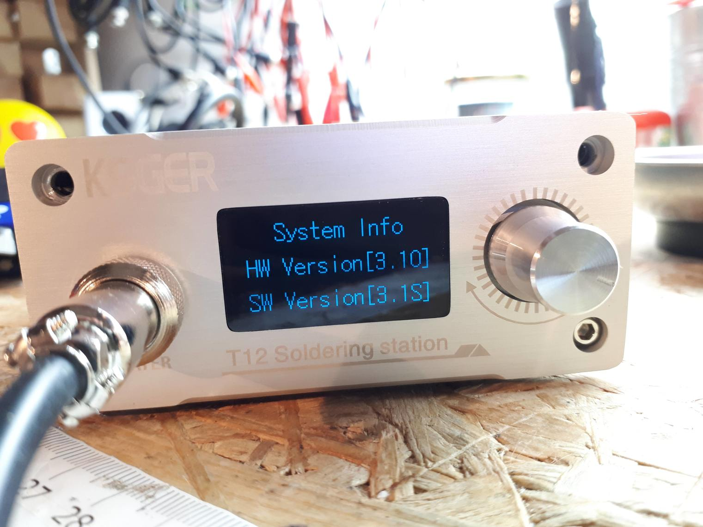

	
# STM32 T12 OLED

<!-- MarkdownTOC -->

* [Known PCB Variants](#known-pcb-variants)
* [Compatibility with Open Firmware](#compatibility-with-open-firmware)
	* [**WARNING!!** Before flashing](#warning-before-flashing)
	* [Supported](#supported)
		* ['v1.5' Original Version \(PT Dreamer\)](#v15-original-version-pt-dreamer)
		* ['v2.1S' Original Version \(Green PCB\)](#v21s-original-version-green-pcb)
	* [Experimental](#experimental)
		* [Blue PCB 'Ve2.1S' r2 KSGER Version \(LWFP-64\)](#blue-pcb-ve21s-r2-ksger-version-lwfp-64)
	* [Unknown or Not Supported](#unknown-or-not-supported)
		* [v3.0 r0 \(Black PCB\), aka 'OLED-V3.0'](#v30-r0-black-pcb-aka-oled-v30)
		* [Version 3 and newer](#version-3-and-newer)

<!-- /MarkdownTOC -->

## Known PCB Variants

This is not an exhaustive list. However generally speaking here you will find the following versions of the soldering iron controller known as 'STM32 T12 OLED' or sold under similar names. Typically these PCBs are manufactured by KSGER or QUICK. Or are otherwise clones of the original 'STM32 T12 OLED' station from an earlier time, before KSGER started manufacturing it.

* OLED-V3.0 (black PCB) same as 2.1S but no pump control, 6-pin OLED, no R20 battery killer, ref. designators shuffled, no resistor packs, battery on board, JBC option R0 may be fixed. Looks like a cheaper build.
* Ve2.1S (blue PCB, "RCT6" package 64pin) Very similar as "CBU6" package. Seems from same guys just modified for larger pin count CPU package, cheaper to source.
* Ve2.1S (blue PCB, "CBU6" package, 32pin) has pump control and buck-converter. JBC option: must cut R11 bridge. (maybe can hook a switch there to keep T12 handle option).
* 2.1S (green PCB) has pump control and SPX2954 LDO for 3.3V
* 2.1  (sometimes called 2.1S) has no pump control and an LDO for 3.3V, not buck-converter.
* 2.01 fixed the (2.0) LDO overheating, added copper-pour heatsink.
* 2.0  is a failed design using SOT-89 LDO for 3.3V that overheated from no heatsinking, and no snubber on the MOSFET.
* 1.5  oddball design using dual buck/LDO vregs, 4-pin GX12 connector like Quicko, and dual op-amp for thermocouple amp. PT Dreamer's Blog reverse engineered it and made custom open firmware for it.

## Compatibility with Open Firmware

* WARNING: **Not all the PCB are compatible with this open firmware!**
* Browse **subfolders** here, to find photos and schematics.
* WARNING: **Not all of the PCB in subfolder are compatible either!** (only some)
* Not all pcb that *exists* is included in subfolder here. Please fork / add missing ones.

Currently only the LQFP-48 version (of 'v2.1S' PCB) is known to be supported by this branch of the PTDreamer's code. Other PCBs ***may work***, to a greater or lesser extent. Or they might not. We do not know enough about them yet. Flash the open firmware at own risk.

### **WARNING!!** Before flashing

***[Backup the OFW](/tools/software/STM32CubeIDE#choosing-a-method-to-backup-the-ofw)***.

**Most simple** and most practical way to backup your original KSGER firmware is to **physically remove the original STM32 chip with a hot air station**. And replace it with a new blank chip for programming the open firmware. Keep the old chip safe and a label it clearly. This is the recommended method.

We do not recommend flashing over your existing official firmware (OFW) without first of all taking steps to ensure that you can recover back to the original stock image. In case the open source firmware is not to your liking, or cannot work with your specific hardware.

### Supported

There is a fork of ptdreamer's firmware, adapted for a `v2.1s` PCB revision. These are all slightly different STM32 soldering controller.

Unfortunately there appear to be multiple so-called 'v2.1S' hardware revisions floating around out there. Generally speaking they both use some type of an STM32 MCU. You should be sure to check very carefully (and in detail) for verifying your board.

#### 'v1.5' Original Version (PT Dreamer)

* [Folder with schematic, pictures, etc.](v1.5-ptdreamer-orig)

This hardware is compatible with [PTDreamer's Open Firmware](/research/ptdreamer) (original version). As found on PTDreamer's original [Github repo](https://github.com/PTDreamer/stm32_soldering_iron_controller). However this is now a very old version of the PCB and is no longer available for sale, for quite some time. So it is rather difficult to find or obtain.

#### 'v2.1S' Original Version (Green PCB)

* [Folder with schematic, pictures, etc.](v2.0-and-v2.1-original/r1)
* [Aliexpress purchase link](https://www.aliexpress.com/item/32844179319.html) (may expire)

**Original version of the v2.1S hardware**. This is the preferred hardware for v2.1s because this original version is from a time before KSGER started cutting costs in later designs.

* [Newer Forked version](https://github.com/dreamcat4/stm32_soldering_iron_controller) of PT Dreamer open firmware - updated to instead work for 'V2.1S hardware'.

**Updated version:**

There is also an updated version of this original PCB. Which looks very similar, but with added compatibility for JBC T245 / C245 tips.

* [Folder with schematic, pictures, etc.](v2.0-and-v2.1-original/r2)

### Experimental

These PCBs *might work* with the Open Firmware. However they have only been tried by very few others. And there might be hardware issues that still require fixing. Use at your own risk! Please backup first (=replace chip with hot air).

Please submit PR, open issues in tracker for further discussion, etc.

#### Blue PCB 'Ve2.1S' r2 KSGER Version (LWFP-64)

* The [floobydust schematic, rev2](https://github.com/dreamcat4/t12-t245-controllers-docs/blob/master/controllers/stm32-t12-oled/v2.1s-and-Ve2.1S/KSGER%20STM32%20Ver2_1S%20schematic%20rev%202_floobydust.pdf), Source - [thread on eevblog](https://www.eevblog.com/forum/reviews/t12-stm32-v2-1s-soldering-station-controller-schematic-etc/msg2463234/#msg2463234)
* [Folder with schematic, pictures, etc.](v2.1s-and-Ve2.1S)

It's current status is considered to be **Experimental**. 1 user has reported to have flashed it and says that 'it also works'. This other PCB. However maybe some aspects do not work as intended. So try at your own risk!

In particular there are cost cutting changes to the design. For example it's been reported that the op-amp is of a low quality and bad. 3.3v voltage regulator might also be bad.

We can see from the photo (below) that the MCU is an [STM32F103RCT6](https://octopart.com/stm32f103rct6-stmicroelectronics-8119626) with 256kb of flash. This was also another cost cutting measure. Actually that version of the chip is better than previous models. But the extra memory and pins are simply not used. The reason it's been used is because it became cheaper to source than other variants of the STM32. So don't let that fool you.

### Unknown or Not Supported

These PCBs are not tested yet by anybody with this Open Firmware. And are unlikely to work without further modifications. You are welcome to backup your own chip (= hot air replace it), and then try to work on support. Please submit PR, open issues in tracker for further discussion, etc.

#### v3.0 r0 (Black PCB), aka 'OLED-V3.0'

These newer pcbs looks very similar to the above version ^^ "Blue PCB 'Ve2.1S' r2 KSGER Version (LWFP-64)"

* The [cosmin - floobydust schematic, rev1](https://github.com/dreamcat4/t12-t245-controllers-docs/raw/master/controllers/stm32-t12-oled/v3.0-and-v3.1/r0/KSGER%20STM32%20OLED-3_0%20schematic%20rev1_cosmin_floobydust.pdf), Source - [thread on eevblog](https://www.eevblog.com/forum/reviews/stm32-oled-digital-soldering-station-for-t12-handle/msg3364926/#msg3364926)
* [Folder with schematic, pictures, etc.](v3.0-and-v3.1/r0)
* More details [in this eevblog post](https://www.eevblog.com/forum/reviews/stm32-oled-digital-soldering-station-for-t12-handle/msg3387712/#msg3387712)
* Similar versions called "V3.1S" [on eevBlog Forums](https://www.eevblog.com/forum/reviews/ksger-t12-stm32-v3-1s-soldering-station/msg2873548/#msg2873548)

Although being called v3 actually this specific PCB looks very similar to our "Ve2.1S r2" so is considered to be a 3rd revision of the previous `V2.1S` line. With the same larger 64-LQFP MCU. And also the Green capacitor on it. It is very similar looking.

Which is something promising. However tread carefully! Because KSGER are also known to be making some small change for example the GPIO pin layout. Which is not necessarily all the same as before. Looking more closely we see suble changes in the layout with groups of the smaller SMD components.

This is confusing when you check the menu, because it does appear to be calling itself 'V3' in the menu. Both the hardware and software:

So clearly it's not quite the same thing anymore. However it does appear to be an update (revised and newer) version of the 'Ve2.1S r2' PCB. So this one might be worthwhile to try with an Open Firmware. But only after following all the trace layout. And comparing it to the previous version.

Nobody has tested this firmware onto that version of the PCB. So it's current support status is considered to be **Unknown**. Until somebody comes along and can confirm that it works.

However we may otherwise be able to get some schematics for this version and compare it to the other previous one.

#### Version 3 and newer

These are newer PCB and have may have cost cutting components on them. They are not tested or not supported by any Open Firmware.

* [Folder with schematic, pictures, etc.](v3.0-and-v3.1/r2)

and

