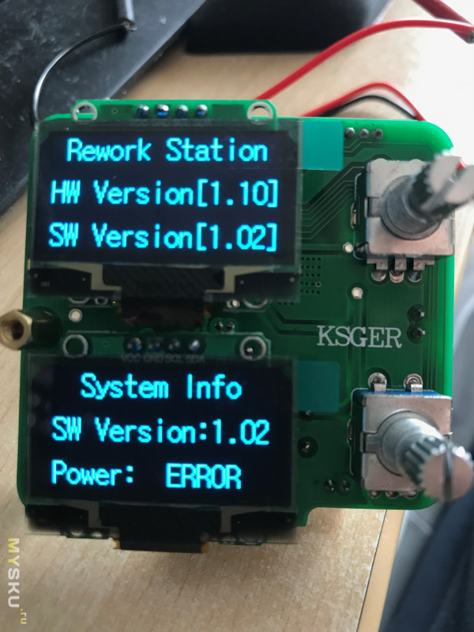

# STM32 T12 Combo

Not much is known about this one. Other than it has 2 screens (but both are driven from 1 MCU). There is no Open Source Firmware, only a precompiled closed binary `.hex` is available for it.

But at least we do appear to have the schematics for it here. So that might be some use if you already happen to have this specific hardware.

### Open Source Hardware Design

by Evgen Kovalenko

This appears to be an [Open Source redo](/research/easyeda) of this same 'T12 Combo' station. This includes a much better (and editable!) schematic, gerbers, etc.

* Link: https://easyeda.com/evgen2910/cd_stm32_t12_combo
* **Accessible version:** [mirrored, translated to english](https://htmlpreview.github.io/?https://media.githubusercontent.com/media/dreamcat4/t12-t245-controllers-docs/master/research/easyeda/CD_STM32_T12_Combo%20-%20EasyEDA%20(2020-07-05%2023_06_41).html)

