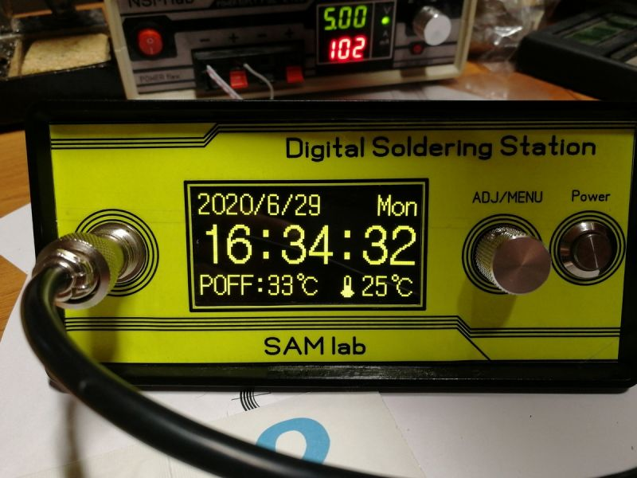
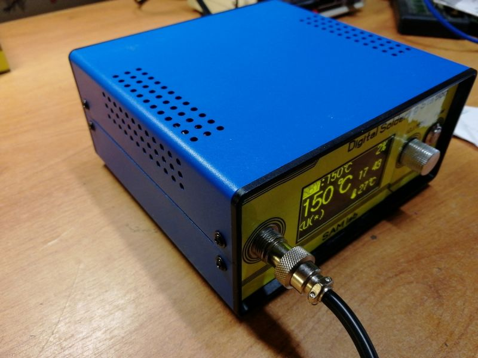
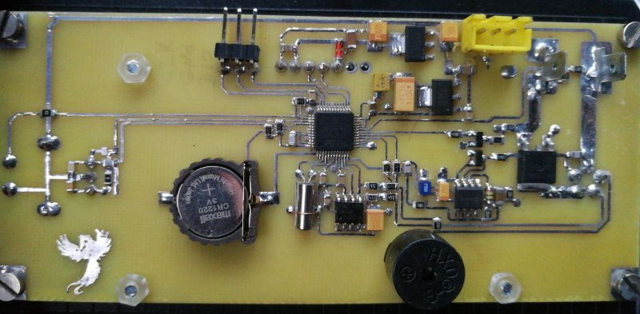
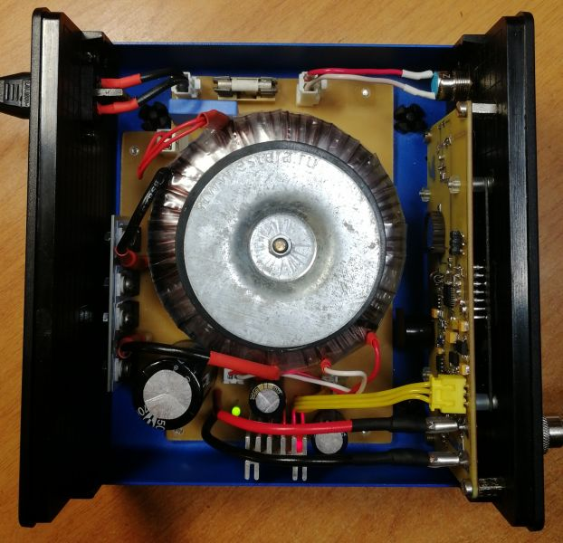
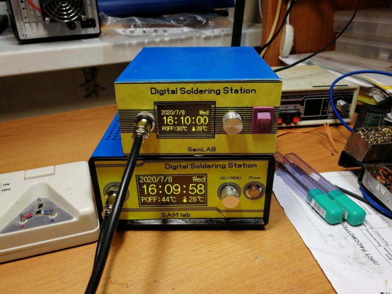

# BV-Dial's Diy Station

This appears to be a home made version of the Original v2.1 hardware. Includes schematic and PCB layout (files are Sprint Layout 6 format). Home etched PCB.

[Post by BV-Dial](https://radiokot.ru/forum/viewtopic.php?p=3864854#p3864854) - Accessible version: [mirrored, Translaged to english](https://htmlpreview.github.io/?https://media.githubusercontent.com/media/dreamcat4/t12-t245-controllers-docs/master/controllers/stm32-t12-oled/radiokot_bv-dial_diy/Forums%20-%20View%20topic%20-%20T12%20soldering%20station%20on%20stm32.html)

## Forum Post Translation - English

Forum has calmed down, summer, heat - holidays, summer residences.

He finished the monthly testing of the new PS. The circuit is old - the display is new (2.42 OLED), the soldering iron is also new (for me) the UD-2245A is a JBC 2245 clone. I will be honest with the soldering iron First +. The handle has a comfortable grip. Sting miniature as a nail 100. Heating from room to melting 1.5mm solder bar for 6-7 seconds. Gouged easily. He took 3 stings SK2.5 (knife), SK2.0 (smaller knife) and 035 (curved short needle). Now minus. There is a lot of power, you need a large iron-copper transformer, the heater resistance is 2.6 Ohms (I have a 135-watt toroid), there is no heating, because. max load current only at startup. Cable 3 core and thin (D- 3.5mm). And the biggest minus for me is the handle is not collapsible, or I did not understand how it is disassembled.

  

Compare the UD-2245A with the Quick TS1200A. Schemes and iron identical

.

In my humble opinion, the UD-2245A conditionally outperforms the Quick TS1200A, and especially the T12. Change the lace to a more decent one and the convention will be removed.

The heat in the garage didn’t do its own work, and it was purchased in the fall of 11.11 ( "Iron housing for electronics diy instrument case project case iron electric junction box DIY amplifier metal box 150*140*70mm" - [Aliexpress Link](https://aliexpress.ru/item/32908409916.html?spm=a2g0s.12269583.0.0.2e1a7bcfuXm9jx) ). The case is excellent, delivery is dizhe expensive now. But since took a long time and a few pcs, then the price eventually arranged.

Circuit and board. Firmware (T12_HW21S_Encryption-SSD1306.hex)

