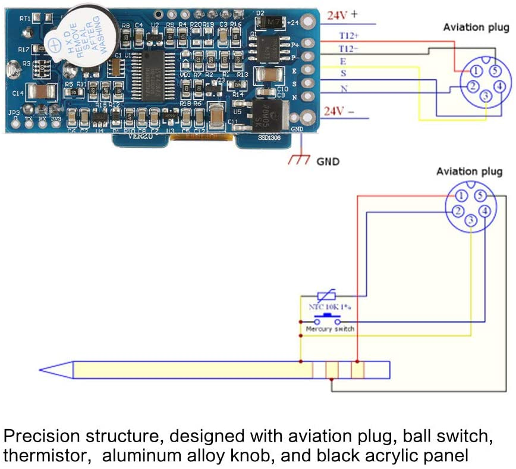
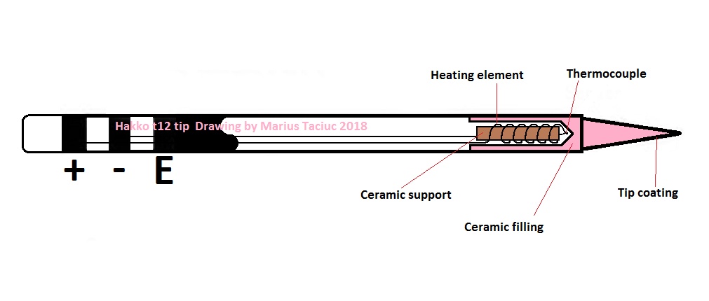
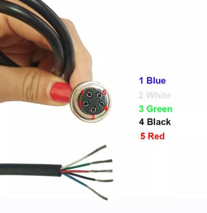
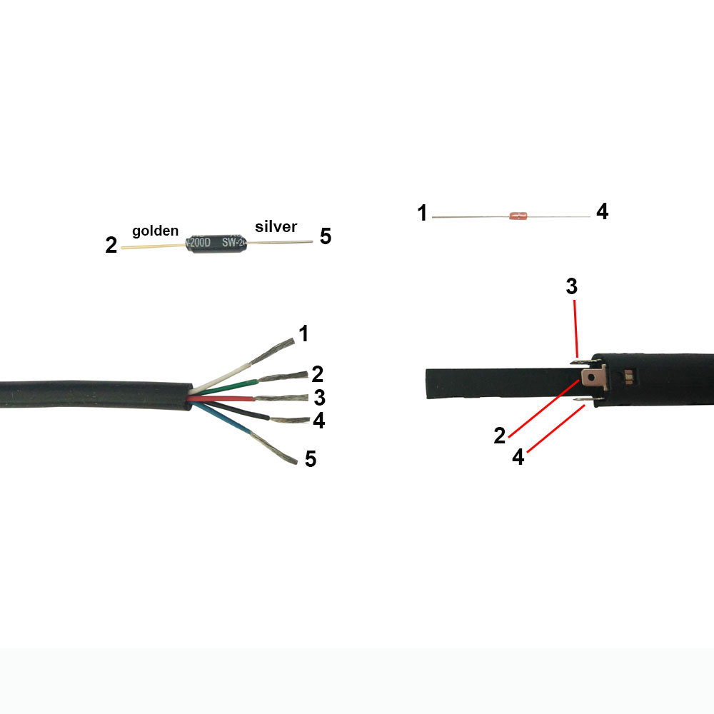
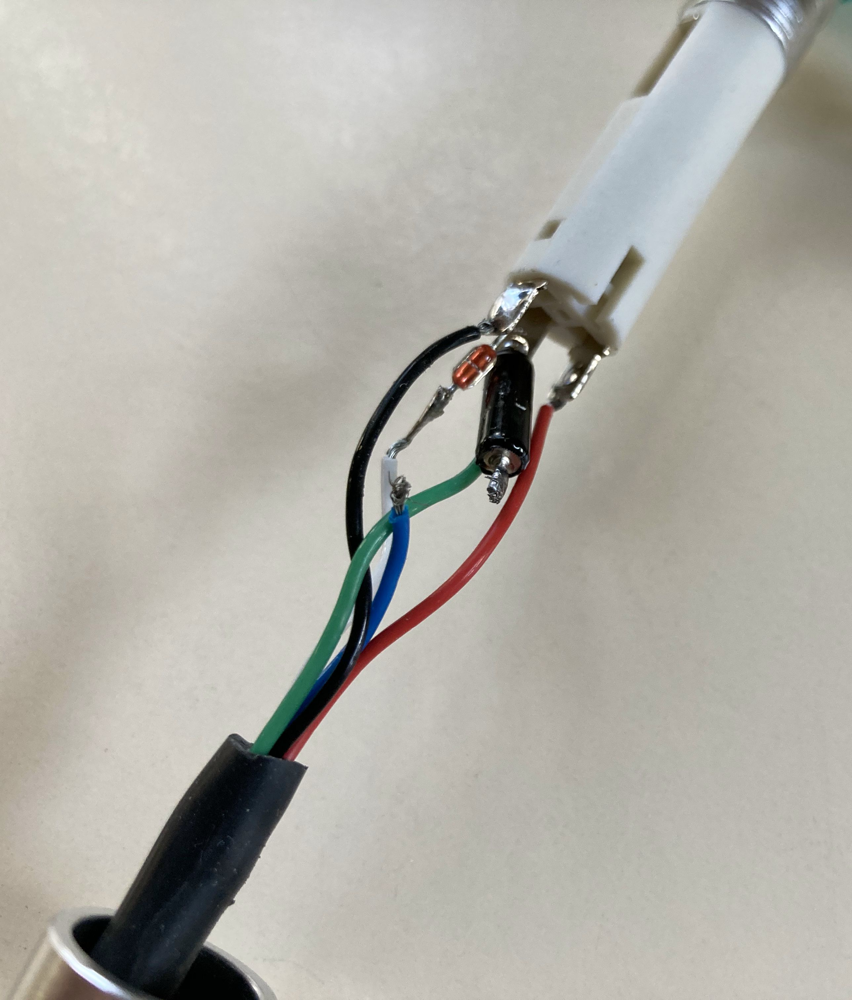

# T12 Handles

<!-- MarkdownTOC -->

* [Circuit](#circuit)
* [Tip](#tip)
* [Thermocouple](#thermocouple)
* [GX12-5 Pin Connector](#gx12-5-pin-connector)
* [NTC Thermistor & SW-200D Tilt Switch](#ntc-thermistor--sw-200d-tilt-switch)
* [KSGER Aluminium Handle](#ksger-aluminium-handle)
  * [Wiring in the handle](#wiring-in-the-handle)

<!-- /MarkdownTOC -->

## Circuit

## Tip

## Thermocouple

The T12 thermocouple is oddball metallurgy, measured empirically in Hakko Patent US6087631A for the look up table, 20-21uV/°C accurate from 200°-600°C.

## GX12-5 Pin Connector

## NTC Thermistor & SW-200D Tilt Switch

* Datasheet for SW-200D Tilt switch - https://raw.githubusercontent.com/SeeedDocument/Grove-Tilt_Switch/master/res/SW200D_datasheet.pdf

## KSGER Aluminium Handle

* Purchase Link: https://www.aliexpress.com/item/33004762167.html

### Wiring in the handle

|GX12 Pin|Wire Color|T12 Pin|Function|
|--------|----------|-------|--------|
|1       |Blue      |       |SW-200D Tilt switch, then to Ground (Green wire)|
|2       |White     |       |NTC Thermistor (unknown, 104?, looks like 102PS1J?), then to - (Black wire) |
|3       |Green     |E      |Tip Ground|
|4       |Black     |-      |Heater Negative|
|5       |Red       |+      |Heater Positive|

