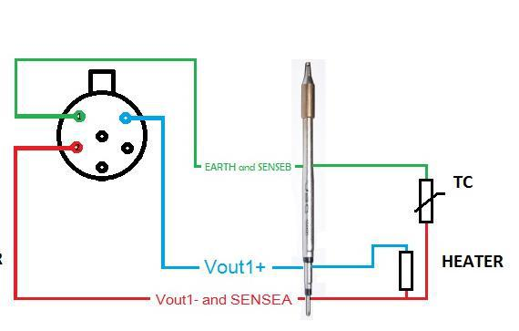
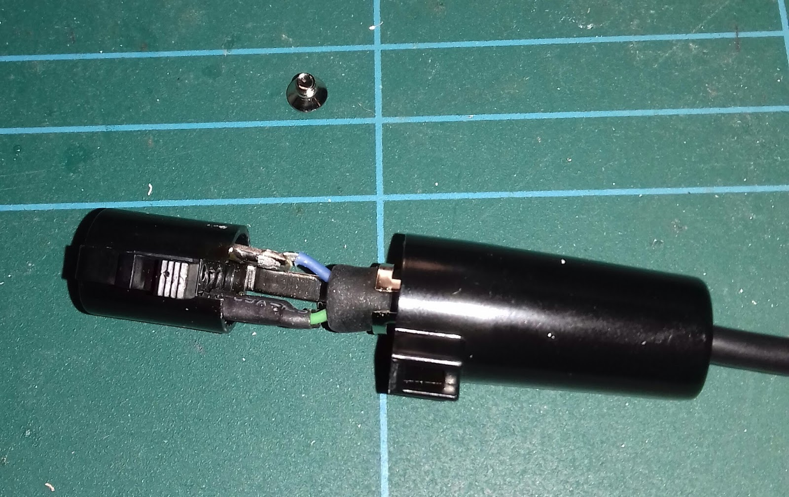
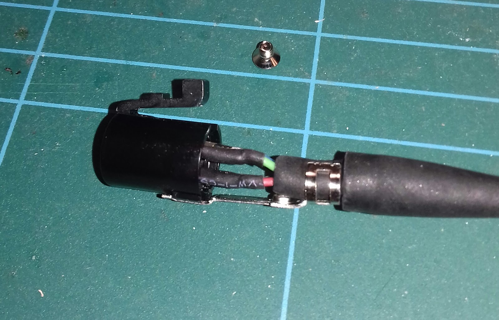
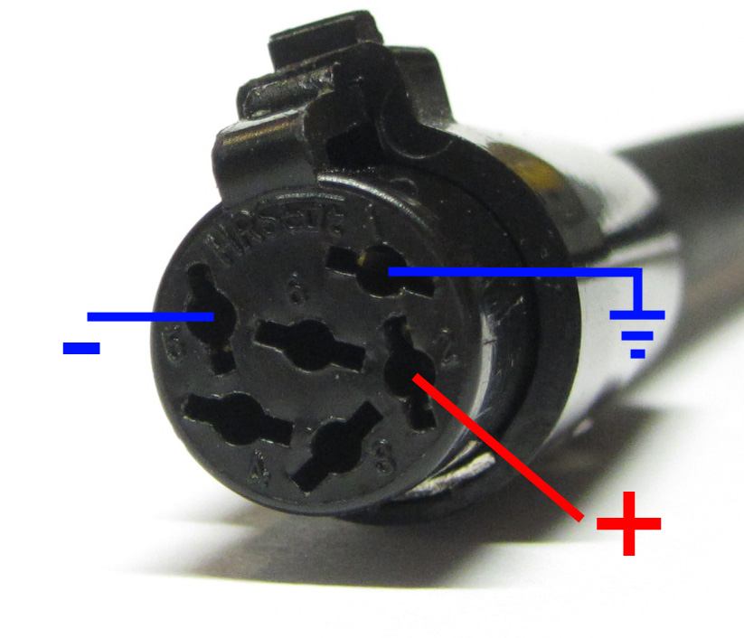
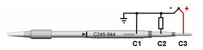
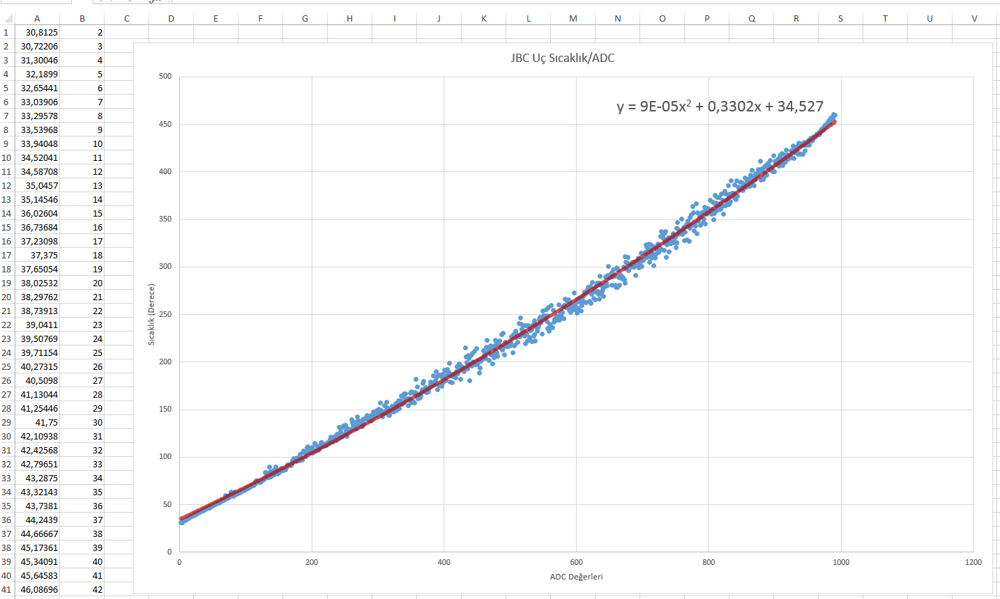
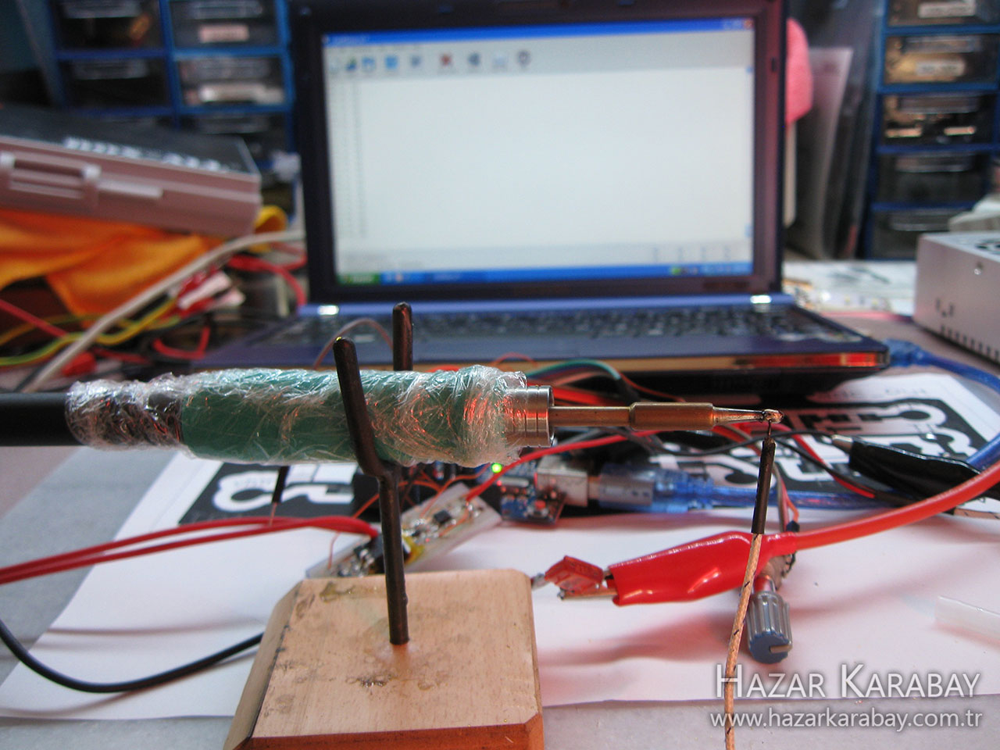

# T245 / C245

<!-- MarkdownTOC -->

* [Wiring](#wiring)
	* [In the handle](#in-the-handle)
		* [Diagram by GeriTheFox](#diagram-by-gerithefox)
		* [Ricardo's Photos](#ricardos-photos)
* [Thermocouple](#thermocouple)
	* [Cross Section Image](#cross-section-image)
	* [Thermocouple plot from Hazar's Blog](#thermocouple-plot-from-hazars-blog)
* [Universal Soldering Iron](#universal-soldering-iron)
	* [JBC C245](#jbc-c245)
* [Diy Handle](#diy-handle)

<!-- /MarkdownTOC -->

## Wiring

### In the handle

#### Diagram by GeriTheFox

* Link: https://easyeda.com/GeriTheFox/soldering-station - ([**Mirror**](https://htmlpreview.github.io/?https://media.githubusercontent.com/media/dreamcat4/t12-t245-controllers-docs/master/research/easyeda/DIY%20JBC%20245%20Soldering%20Iron%20Controller%20(Beta%20WIP)%20-_%20EasyEDA%20(2020-07-05%2022_46_02).html))

#### Ricardo's Photos

Photos of the Handle cable's wiring to the Hi-rose connector

* From the: [Speaky Blog, by Ricardo - CT2GQV](https://speakyssb.blogspot.com/2018/03/jbc-t245-c245-iron-tip-controller.html) - [mirror](https://htmlpreview.github.io/?https://github.com/dreamcat4/t12-t245-controllers-docs/blob/master/tips-and-handles/t245-c245/The%20_Speaky_%20HF%20SSB%20transceiver%20and%20other%20homebrew%20projects_%20JBC%20T245%20_%20C245%20Iron%20tip%20controller%20(2020-07-05%2021_16_01).html)

## Thermocouple

### Cross Section Image

### Thermocouple plot from Hazar's Blog

Characterization of thermocouple. With Excel plot against a regular 'type-K' thermocouple.

* JBC Tip Temperature / ADC - [raw capture data](CoolTerm-Capture-2016-07-03-18-24-28.txt)

Hazar's investigations into C245 thermocouple, using the [MAX6675 K-Type Thermocouple](/tools/k-type%20thermocouple). This is a great guide if you want to take measurements yourself.

* Original version: [on Hazar's Blog](http://www.hazarkarabay.com.tr/elektronik/jbc-kontrolcu-sicaklik-olcumu/)
* **Accessible version:** [Mirrored, translated to english](https://htmlpreview.github.io/?https://github.com/dreamcat4/t12-t245-controllers-docs/blob/master/tips-and-handles/t245-c245/JBC%20Controler_%20Temperature%20Measurement%20(2020-06-16%2010_25_36).html)

## Universal Soldering Iron

* **Taken from:** The "Really Universal Soldering Controller" project.
* **Source:** [http://dangerousprototypes.com/forum/index.php?topic=7218.0#p66362](http://dangerousprototypes.com/forum/index.php?topic=7218.0#p66362)

### JBC C245

- Outer shell (green wire) connected to EARTH and SENSEB
- Heater positive(red wire) connected to Vout1- and SENSEA
- Heater negative(blue wire) connected to Vout1+
- 150ohm between ID and Vout1-
- 5.6k between ID and Vout2-

## Diy Handle

If you don't want to buy one, [you can make one](diy-handle)

