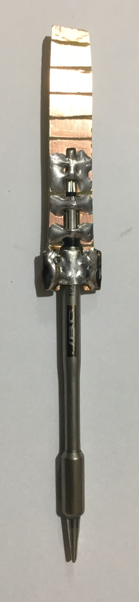
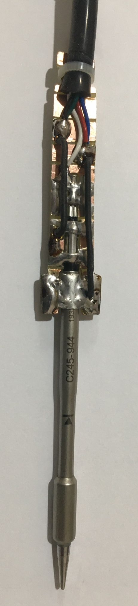
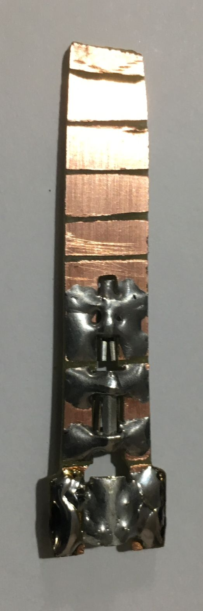
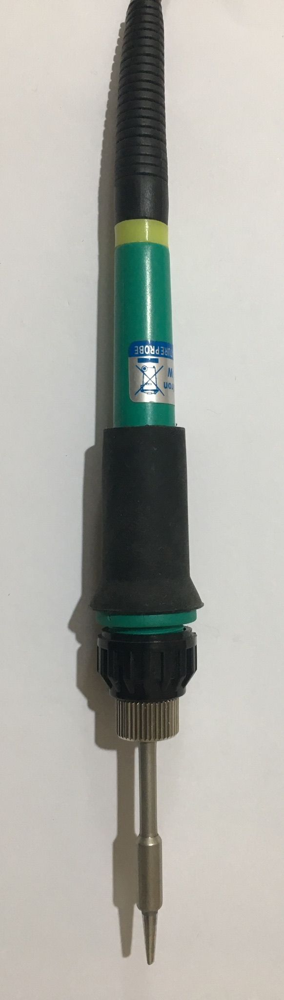

# T245 / C245

<!-- MarkdownTOC -->

* [Wiring](#wiring)
* [Diy Handle](#diy-handle)

<!-- /MarkdownTOC -->

## Wiring

## Diy Handle

If you don't want to buy one, you can make one.

   
  

  
   

