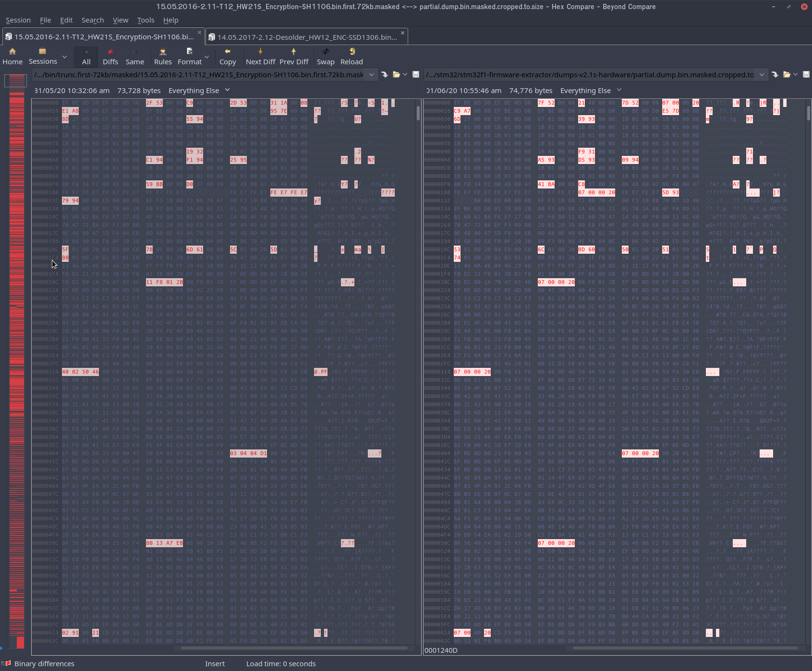

# STM32 Development tools

How to setup development, debugging, flashing, etc. for the STM32 hardware platform. This guide is particularly relevant to the series of soldering iron controllers with names like 'STM32 OLED T12'. Or specific variations of that. However many of these steps here apply equally well to any other hardware devices based around the STM32 series of MCUs.

<!-- MarkdownTOC -->

* [Install Dependancies](#install-dependancies)
    * [Install STM32CubeIDE](#install-stm32cubeide)
        * [About STM32CubeIDE](#about-stm32cubeide)
        * [About STM32CubeMX](#about-stm32cubemx)
    * [Install OpenOCD](#install-openocd)
* [Building / Compiling This Firmware](#building--compiling-this-firmware)
    * [Building in STM32CubeIDE](#building-in-stm32cubeide)
    * [Debugging within STM32CubeIDE](#debugging-within-stm32cubeide)
* [Connecting Hardware](#connecting-hardware)
* [OpenOCD](#openocd)
    * [Connecting over STM32CubeIDE](#connecting-over-stm32cubeide)
    * [Connecting over Telnet](#connecting-over-telnet)
        * [Flash Info](#flash-info)
        * [Reset Halt](#reset-halt)
* [Choosing a method to backup the OFW](#choosing-a-method-to-backup-the-ofw)
    * [Option 1. Replace the MCU](#option-1-replace-the-mcu)
    * [Option 2. Power glitching timing attack \(difficult\)](#option-2-power-glitching-timing-attack-difficult)
    * [Option 3. Compare partial dump to other known OFW Images](#option-3-compare-partial-dump-to-other-known-ofw-images)
        * [Recover partial firmware image](#recover-partial-firmware-image)
        * [Running 'stm32-partial-image'](#running-stm32-partial-image)
        * [Compare partial dump to known OFW images](#compare-partial-dump-to-known-ofw-images)
* [Flash the new firmware](#flash-the-new-firmware)

<!-- /MarkdownTOC -->

<a id="install-dependancies"></a>
## Install Dependancies

These instructions were tested on **Ubuntu 19.10 Linux**. You can do on other platforms which are also available for these software. Check the same links here below. However some of your installation steps may differ.

<a id="install-stm32cubeide"></a>
### Install STM32CubeIDE

Download page:

https://my.st.com/content/my_st_com/en/products/development-tools/software-development-tools/stm32-software-development-tools/stm32-ides/stm32cubeide.html


* Unzip the installer

```sh
mkdir stm32cubeide_1.2.0_setup
cd stm32cubeide_1.2.0_setup
unzip ../en.st-stm32cubeide_1.2.0_5034_20200108_0926_amd64.deb_bundle.sh.zip
```

* Launch the graphical installer

```sh
sudo ./st-stm32cubeide_1.2.0_5034_20200108_0926_amd64.deb_bundle.sh
```

After installing STM32Cube**IDE**, go ahead and launch the program. And check for updates. If a newer version is found then download and install / update using the built in updater. The program will relaunch itself.

<a id="about-stm32cubeide"></a>
#### About STM32CubeIDE

This is a skinned Eclipse IDE. Customized for working on projects for STM32 by ST Microelectronics. Those customizations will include other package dependancies, libraries, plugins, etc. There is a hidden Eclipse `.project` file in the codes root folder. From which the code can be opened in this IDE tool, for editing. And then also compiled / built into a `.BIN` or `.ELF` file for flashing. There may also be tools for debugging etc.

**Note:** When you first launch this program it does not show the main workspace. Where the open projects get displayed to. You have to manually click an icon in the top left corner, in order to get to that view.

STM32Cube**IDE** also now includes within it a related tool named STM32Cube**MX**. Which is used for pin assignments, and configuring the clock generator / PLLs and other interfaces, debugging modes, etc.

<a id="about-stm32cubemx"></a>
#### About STM32CubeMX

This used to be a seperate tool. And is in fact also still available for download standalone. However now MX has been rolled into the IDE. The MX tool can be opened by clicking on the `.ioc` file in the project's root folder. It will then open in a new tab within the same Eclipse IDE. It lets you setup the GPIO pins, the ADCs and other onboard functions as to what specific mode(s) they are configured and deployed as. For example if you enable a UART you might have to disable an SPI port. etc. You can also configure the clock generator and the PLLs.

Changes should be reflected / updated into the project's C source code files. With stub functions, templated `main()` loop and the setup of other applicable code structures etc. Which then in turn can be manually edited and tweaked.

<a id="install-openocd"></a>
### Install OpenOCD

[**OpenOCD**](http://openocd.org/doc/html/index.html#SEC_Contents) is a linux tool for embedded programming and debugging. You will also need to hook up some connections with an appropriate interface / adapter to your PC.

These instructions were tested to work on Ubuntu Linux 19.10. For other platforms you will need to perform other steps. Which isnt documented here.

I have been told by the folks at OpenOCD project that most available versions of openocd, all since OpenOCD version `0.10.0` should work OK. That can be installed by your local package manager, etc. However if you happen to encounter problems then here are the instructions for compiling from source code (git). Which is what I did:

```sh
# remove the official package, if already installed
sudo apt remove openocd

# download latest official version with git
git clone https://git.code.sf.net/p/openocd/code openocd
cd openocd

# # you can use master branch, or checkout the most recent release
# git branch -r | grep -i "origin/v" | sort | tail -1
# git checkout origin/v0.6.1

./bootstrap

# see the list of supported compiler options
./configure --help

./configure
make

# install into /usr/local
sudo make install
```

<a id="building--compiling-this-firmware"></a>
## Building / Compiling This Firmware

<a id="building-in-stm32cubeide"></a>
### Building in STM32CubeIDE

You can download as a `.zip` from Github, or use Git:

```sh
git clone https://github.com/dreamcat4/stm32_soldering_iron_controller.git
```

Then go ahead and open this code folder in STM32Cube**IDE**. By going to **File --> Open Project** in the main menu.

After loading the project up you will need to navigate to your main Eclipse **Workspace**, which contains the list of all your projects. Then left click on the **Project* that you have just opened. In order to highlight it.

From here you can either expand the top level project folder and double click on the **`.IOC`** file to open up STM32Cube**MX** sub window. To see pin assignments etc.

Or you can right select the top level project folder, and navigate to **Project --> Properties**, to select the active build target as either **Debug** or **Release**.

After selecting the Build Target, you can compile for that target. And a binary `.BIN` and `.ELF` should be built. From within the STM32 IDE.

<a id="debugging-within-stm32cubeide"></a>
### Debugging within STM32CubeIDE

You can also select **Run --> Debug Configurations...** once you have selected the **Debug** build target. And from here select which **Debugger** to connect to. I recommend **OpenOCD** on `localhost` port `3333`.

Aside from OpenOCD there are 2 other supported SWD compatible debuggers available to choose from:

* [J-Link](https://www.segger.com/downloads/jlink/)
* [ST-Link](https://www.st.com/en/development-tools/st-link-v2.html#tools-software).

In fact a version of ST-Link may already be embedded into STM32Cube**IDE** itself. If you have a officially compatible device. There is also an [Open source version of ST-Link](https://github.com/stlink-org/stlink), which IDK if it's feature complete, and may still be developing it's set of supported features.

Those are available seperately and not tested in this guide. The debugger we cover is OpenOCD.

<a id="connecting-hardware"></a>
## Connecting Hardware

For all guide connecting to STM32 chip over SWD Protocol. This section has moved to [Programmers folder](/tools/programmers/stm32-swd-protocol).

<a id="openocd"></a>
## OpenOCD

<a id="connecting-over-stm32cubeide"></a>
### Connecting over STM32CubeIDE

Once you have successfully established a connection over SWD protocol with the `openocd` prigram. Then OpenOCD should stay open and running in a server. It should say:

```sh
Info : starting gdb server for stm32f1x.cpu on 3333
Info : Listening on port 3333 for gdb connections
```

This then lets you to back to STM32Cube**IDE** and input `localhost` port `3333` into the Debugger settings under **Run --> Debugger Configuration...**. And then you can establish a connection to the hardware. And use this link for hardware debugging etc.

<a id="connecting-over-telnet"></a>
### Connecting over Telnet

If OpenOCD has establisted a successful connection over SWD. Then you may also connect over `telnet`. But using the following command. This will let you run some very helpful commands through `openocd` interactively. For example to probe the device information. To backup the firmware. Or to flash a new firmware etc.

Once you login over telnet you should see the following output:

```sh
64° [id:~/.dev/stm32/openocd] master(+0/-0) ± telnet 127.0.0.1 4444
Trying 127.0.0.1...
Connected to 127.0.0.1.
Escape character is '^]'.
Open On-Chip Debugger
> 
```

Now you can run any commands in the openocd documentation. Here are some examples:

<a id="flash-info"></a>
#### Flash Info

The command `flash info 0`, when run over telnet port `4444`. Will show a memory map of the flash area embedded on the STM32 MCU controller chip.

As you can see here (below). The Original Firmware is comprised of 32 chunks each of 4kb size. Making a total of `128 KB`. We would do well to remember this information for later on. So the 'guess' by this tool of `512 KB` flash size is wrong. The version of our chip has only `256 KB` flash. It would seem of which only the first `128 KB` is actually being used here. All segments appear to be `protected`. This is some form of DRM protection which prevents us from dumping or examining the existing firmware.

```sh
θ64° [id:~/.dev/stm32/openocd] master(+0/-0) ± telnet 127.0.0.1 4444
Trying 127.0.0.1...
Connected to 127.0.0.1.
Escape character is '^]'.
Open On-Chip Debugger
> init
> flash info 0
device id = 0x10036414
STM32 flash size failed, probe inaccurate - assuming 512k flash
flash size = 512kbytes
#0 : stm32f1x at 0x08000000, size 0x00080000, buswidth 0, chipwidth 0
    #  0: 0x00000000 (0x1000 4kB) protected
    #  1: 0x00001000 (0x1000 4kB) protected
    #  2: 0x00002000 (0x1000 4kB) protected
    #  3: 0x00003000 (0x1000 4kB) protected
    #  4: 0x00004000 (0x1000 4kB) protected
    #  5: 0x00005000 (0x1000 4kB) protected
    #  6: 0x00006000 (0x1000 4kB) protected
    #  7: 0x00007000 (0x1000 4kB) protected
    #  8: 0x00008000 (0x1000 4kB) protected
    #  9: 0x00009000 (0x1000 4kB) protected
    # 10: 0x0000a000 (0x1000 4kB) protected
    # 11: 0x0000b000 (0x1000 4kB) protected
    # 12: 0x0000c000 (0x1000 4kB) protected
    # 13: 0x0000d000 (0x1000 4kB) protected
    # 14: 0x0000e000 (0x1000 4kB) protected
    # 15: 0x0000f000 (0x1000 4kB) protected
    # 16: 0x00010000 (0x1000 4kB) protected
    # 17: 0x00011000 (0x1000 4kB) protected
    # 18: 0x00012000 (0x1000 4kB) protected
    # 19: 0x00013000 (0x1000 4kB) protected
    # 20: 0x00014000 (0x1000 4kB) protected
    # 21: 0x00015000 (0x1000 4kB) protected
    # 22: 0x00016000 (0x1000 4kB) protected
    # 23: 0x00017000 (0x1000 4kB) protected
    # 24: 0x00018000 (0x1000 4kB) protected
    # 25: 0x00019000 (0x1000 4kB) protected
    # 26: 0x0001a000 (0x1000 4kB) protected
    # 27: 0x0001b000 (0x1000 4kB) protected
    # 28: 0x0001c000 (0x1000 4kB) protected
    # 29: 0x0001d000 (0x1000 4kB) protected
    # 30: 0x0001e000 (0x1000 4kB) protected
    # 31: 0x0001f000 (0x61000 388kB) protected
STM32F10x (High Density) - Rev: Y

> 
```

However in the next sections, we will try to [follow other online guides](https://blog.zapb.de/stm32f1-exceptional-failure/) to try to better identify which official firmware this is. So that we can have a backup to revert to should our Open Source firmware turn out to be unsuitable for our specific revision of the STM32 pcb.


<a id="reset-halt"></a>
#### Reset Halt

Sending a `reset halt` command to the STM32 over SWD should look something like this:

```sh
> reset halt
target halted due to debug-request, current mode: Thread 
xPSR: 0x01000000 pc: 0x08000100 msp: 0x200037c8
> 
```

If you see some valid address returned by the program counter `pc: 0x08000xxx` that is not `0x00`. This is the firmware program's memory address to jump to for the current exception trap / context. Since we issued a `halt` command an exception gets generated and the program is taken to it's current exception handler.

Then it would appear that it's possible to read flash data **indirectly over the ICode bus**. In order to circumvent the regular data bus ("DCode bus"). That SWD has it's traditional direct access to. This is explained in the [guide here](https://blog.zapb.de/stm32f1-exceptional-failure/)


<a id="choosing-a-method-to-backup-the-ofw"></a>
## Choosing a method to backup the OFW

Now that we have established a connection over SWD interface. It would be simple to flash the chip with our new Open Source PTDreamer firmware. However flashing a new firmware will overwrite the original factory firmware (OFW). Which is then lost. Making it impossible to restore the device back to it's original state. This situation is not desirable if the device ends up having some compatibility issue with the open source firmware. For example the device might not be supported yet due to different wiring of the MCU pins etc.

The original firmware (OFW) flashed in the device is most likely to be copy protected. As we saw returned by the command `flash info 0`, which we issued in the interactive session earlier in this readme. After connecting to the OpenOCD background task through `telnet localhost 4444`. We issue the command `flash info 0` and it will report `protected` for all of the flash blocks.

There are 3 main options:

* [Replace the MCU](#option-1-replace-the-mcu)
* [Power glitching timing attack \(difficult\)](#option-2-power-glitching-timing-attack-difficult)
* [Compare partial dump to other known OFW Images](#option-3-compare-partial-dump-to-other-known-ofw-images)

**Newer T12 OLED controllers:**

For newer OLED T12 controllers. If the `Software Version:` shown in the menu is `3.00` os anything higher.

This means the recommended backup method is to replace the MCU entirely (option 1). And not bother to try partially dumping the existing OFW. Since there the original (full) version of those binaries are not available. So that would be a waste of time.

It has been determined that newer KSGER designs, which may be marked as 'v3' or otherwise marked as 'v2' but use an I2C interface for the display. Those newer controllers are typically designed for in house KSGER firmware. Well after v2 KSGER took that firmware closed. And (at current time of writing) does not distribute such OFW binaries itself, nor are they otherwise available from 3rd party source. Due to those newer firmwares being written and updated in house.

**Older T12 OLED controllers:**

For older style T12 OLED designs, such as the original `V2.1` hardware design. Then you may check the firmware version in the menu. If the `Software Version:` shown in the menu is: `2.11` or `2.12`. Then that might be matching a known OFW binary. However if the `Software Version:` is `2.10` then that does not appear to be available. Or at least is not labelled as such.

For even older version 1.x designs, then an older OFW firmware may indeed also be available. However that is much less common these days.

Can your OFW firmware be found online? Well not all of them are available. The partial dump method can only work if you can also obtain copies of those original 'version 2' firmware files. They are typically found either on a Yandex Disk or Google Drive. Actually there are known to be 2 different uploads floating about. Source links are not provided directly here. But are readily available (at time of writing) by searching for such links in the Russian forums.

If in any doubt, then use option 1 instead. And replace the MCU by hot air.

<a id="option-1-replace-the-mcu"></a>
### Option 1. Replace the MCU

The simplest and most straightforward 'foolproof' method to backup the OFW is to simply desolder the existing processor in it's LQFP package. Removing it from the PCB. And then replacing it with another equivalent (must be compatible!) STM32 chip obtained from somewhere else. You could either buy another one from an electronics supplier. Or alternatively get one from another broken device you happen to have lying around. They are fairly common and found in many consumer electronics!

Then when you need to 'restore back' to OFW. You will need to physically de-solder the microcontroller and re-solder back the original chip. Which you had previously removed and kept for safe keeping.

<a id="option-2-power-glitching-timing-attack-difficult"></a>
### Option 2. Power glitching timing attack (difficult)

There does appear to be a known method which involves power rail glitching during boot up of the MCU. Which is not so easy to achieve and requires good timing. In order to glitch the processor at the correct point during the startup sequence.

Due to the difficulty of that glitching method (and it perhaps requiring an oscilliscope etc. which I do not posess myself). This method is not covered in this section here of the README. Unless somebody else can come along and add it.

However here are some external links which describe the power glitching method.

1. https://tches.iacr.org/index.php/TCHES/article/download/7390/6562/
2. https://github.com/kanflo/opendps/issues/20#issuecomment-443708473
3. https://medium.com/@LargeCardinal/how-to-bypass-debug-disabling-and-crp-on-stm32f103-7116e7abb546


<a id="option-3-compare-partial-dump-to-other-known-ofw-images"></a>
### Option 3. Compare partial dump to other known OFW Images

We can partially recover the firmware [using the following method](https://blog.zapb.de/stm32f1-exceptional-failure/). However every few bytes there will be invalid data. Since not all of the addresses in the block can be mapped to be read this way.

According to the results table towards the end of the blog article, for the STM32F103 series we can extract 89.1% of the flash. And it took approximately 1 hour to extract 128 KB.

<a id="recover-partial-firmware-image"></a>
#### Recover partial firmware image

In this step we simply download the python tool, and execute it. We tell it to revocer the first `N` kilobytes of flash memory. The size of the flash on your STM32 chip will depend on which specific variant of the `STM32F103` series is on your specific PCB revision.

For this example, the flash size is supposed to be `256 KB`. So that is how much we try to extract. Although the size of the OFW program may very well be much smaller than that.

Before starting, we need to have `openocd` running in the background. And connected to the target device over SWD. Waiting for a connection over it's `localhost` ports `3333` (GDB) and `4444` (telnet).

Then we download this python tool, which will in turn run its commands through openocd to the connected target device.

```sh
# 1. download this tool
## git clone https://github.com/dreamcat4/stm32f1-firmware-extractor.git
cd stm32f1-firmware-extractor

# 2. specify the flash size of your STM32 chip (look it up online)
_kilobytes=256   # the amount of flash memory depends on the specific part
_word_size=4     # always 4 (for stm32) - because its '32 bit' architecture


# 3. take the partial dump of the first ??? KB of flash
./main.py --value "0xd00dbeef" --binary 0x00 $(echo $_kilobytes*1024/$_word_size | bc) > partial.dump.bin
````

Now that we have read from the flash our partial firmware image, with the default masking pattern `0xd00dbeef` being somewhat unique. Now you might be worrying because any arbitrary sequence of bytes we choose might also naturally occur somewhere in the flash file. Without us knowing. However it's not critical, and will only upset the `--view` operation of our tool. And not the actual masking operation or binary compare operation. This is because the unreadable bytes are known to recurr in a very specific pattern. That repeats once every 512 byte block.

***Verify the dumped data is valid***

Now that we have taken our firmware dump it is a good idea to manually inspect it. To make sure we have captured a cleam image with no communication errors over the wire. If the dump 'looks like real data'. Then you may additionally decide to take more than 1 flash dump. Then compare the checksums against each other for consistency. This helps to protect against some spurious error due to interference over the wires.

<a id="running-stm32-partial-image"></a>
#### Running 'stm32-partial-image'

Be sure to use [this fork](https://github.com/dreamcat4/stm32f1-firmware-extractor) of the stm32f1-firmware-extractor. Since that is where you can get the extra cmdline tool [`stm32f1-partial-image`](https://github.com/dreamcat4/stm32f1-firmware-extractor/blob/master/stm32f1-partial-image). Which is what we will using in this section.

This small tool, `stm32f1-partial-image`, is just a unix shell script. And it requires some basic unix programs to work. On ubuntu you can install these missing dependancies with:

```sh
sudo apt install -y bc bbe hexdump
```

After checking our dump(s) we have now finished with the Python script `./main.py`. And all subsequent operations will be performed using the other provided shell script named `stm32-partial-image`. This script has a few program dependancies. It was tested on Ubuntu 19.10 running an Intel processor. If you have issues with this script then either it's missing a required program dependancy. Or the endianness (byte order) is wrong. Which might happen if you are running on a non-Intel (and non x86) platform. Such as arm / rpi. Etc. There is an untested flag to try to swap that around.

Now because of a quirk or a loophole in the processor, the first 2 32-bit words (8 bytes) of only the first block were actually correctly recovered. And so these actually also need to masked. To make the entire file a consistent pattern.

So this is our first job: To properly (re)-mask the flash dump. To make it fully consistent so that the masked bytes in first block because the same pattern as for all of the subsequent blocks.

```sh
./stm32f1-partial-image --mask partial.dump.bin partial.dump.bin.masked
```

Now we can view our masked dump by running `./stm32f1-partial-image --view <filename>`. And compare it to the original dump. This tool will automatically detect the magic `d00dbeef` placeholder bytes and replace them with `________` underscores. To make it easier to see the masking pattern.

Something like this:

```sh
./stm32f1-partial-image --view partial.dump.bin > dump.hex.txt
./stm32f1-partial-image --view partial.dump.bin.masked > dump.masked.hex.txt
diff dump.hex.txt dump.masked.hex.txt
1c1
< 0x00000000      200037c8 08000101 0800527f 08004021
---
> 0x00000000      ________ ________ 0800527f 08004021
```

After masking you should see a pattern like this:


```sh
./stm32f1-partial-image --view partial.dump.bin | less

0x00000000      ________ ________ 0800527f 08004021
0x00000010      0800527d 20000007 0800a7c9 ________
0x00000020      ________ ________ ________ 08007de5
0x00000030      0800276d ________ 08000167 08009339
0x00000040      0800011b 0800011b 0800011b 0800011b
0x00000050      0800011b 0800011b 0800011b 0800011b
0x00000060      0800011b 0800011b 0800011b 0800011b
0x00000070      0800011b 0800011b 0800011b 0800011b
0x00000080      0800011b 0800011b 08000981 0800011b
0x00000090      0800011b 0800011b 0800011b 080031f9
0x000000a0      0800011b 0800011b 0800011b 0800011b
0x000000b0      080093a5 080093d5 08009409 0800011b
0x000000c0      0800011b 0800011b 0800011b 0800011b
0x000000d0      0800011b 0800011b 0800011b 0800011b
0x000000e0      0800011b 0800011b 0800011b d00cf8df
0x000000f0      fc34f000 47004800 0800ba41 200037c8
0x00000100      47804806 47004806 e7fee7fe e7fee7fe
0x00000110      e7fee7fe 20000007 e7fee7fe 0800935d
0x00000120      080000ed 8010f3ef 4770b672 8810f380
0x00000130      481d4770 ________ 20007001 8809f380
0x00000140      2101481a 481a7001 5180f04f b6626001
0x00000150      4817e7fe 5180f04f 47706001 f04f4814
0x00000160      60015180 b6724770 8009f3ef 3820b128
0x00000170      0ff0e880 6809490f b5006008 4780480e
0x00000180      eb04f85d 490e480d 7002780a 490d4809
0x00000190      6002680a e8906810 30200ff0 8809f380
0x000001a0      0e04f04e 4770b662 e000ed22 20000153
0x000001b0      e000ed04 2000016c 080060bd 20000150
0x000001c0      20000151 20000174 e001b2d2 2b01f800
0x000001d0      d2fb1e49 22004770 b510e7f6 460a4613
0x000001e0      46194604 fff0f7ff bd104620 f8121e42
0x000001f0      2b003f01 f811d1fb f8023b01 2b003b01
0x00000200      ________ ________ 29001b01 1a80d1fb
0x00000210      46034770 20000007 2b01f800 ________
0x00000220      ________ ________ ________ f0304500
0x00000230      f0214200 ________ f3c0b1a0 f3c253c7
0x00000240      f3c254c7 f3c00116 1ae40016 0100f441
0x00000250      0200f440 4291347d 1c64d301 0049e000
0x00000260      da022c00 2000bc30 f44f4770 23000000
0x00000270      d3014291 43031a89 ea4f0840 d1f70141
```

<a id="compare-partial-dump-to-known-ofw-images"></a>
#### Compare partial dump to known OFW images

For this step we need to obtain a variety of firmwares. And then convert the intel `.HEX` format into binary `.BIN` image format. On unix systems it's something like this:

```sh
# add this line to your login ~/.profile or ~/.bashrc file
alias hex2bin='objcopy --input-target=ihex --output-target=binary'

# BTW if you forget the 2nd argument [outputfile] then your original .HEX file will be trashed / overwritten to .bin
hex2bin inputfile.HEX outputfile.bin
```

Now we can compare the binary `.bin` image against our partial dump which we obtained in the previous step. But first we must also mask it!

```sh
./stm32f1-partial-image --mask outputfile.bin outputfile.bin.masked
```

Now we have 2 similar format files. Both `.bin` binary image (STM32 executable). And both have the same masking pattern of bytes written `d00dbeef`. So we can perform a **binary diff**. For that I recommend the program "Beyond Compare". However there are also other alternative diff tools.

Here is an example of such a comparison. Unfortunately the firmware is not a match:




<a id="flash-the-new-firmware"></a>
## Flash the new firmware

***T.B.D.***

We want to backup the OFW first. Or know how to get back to it.


